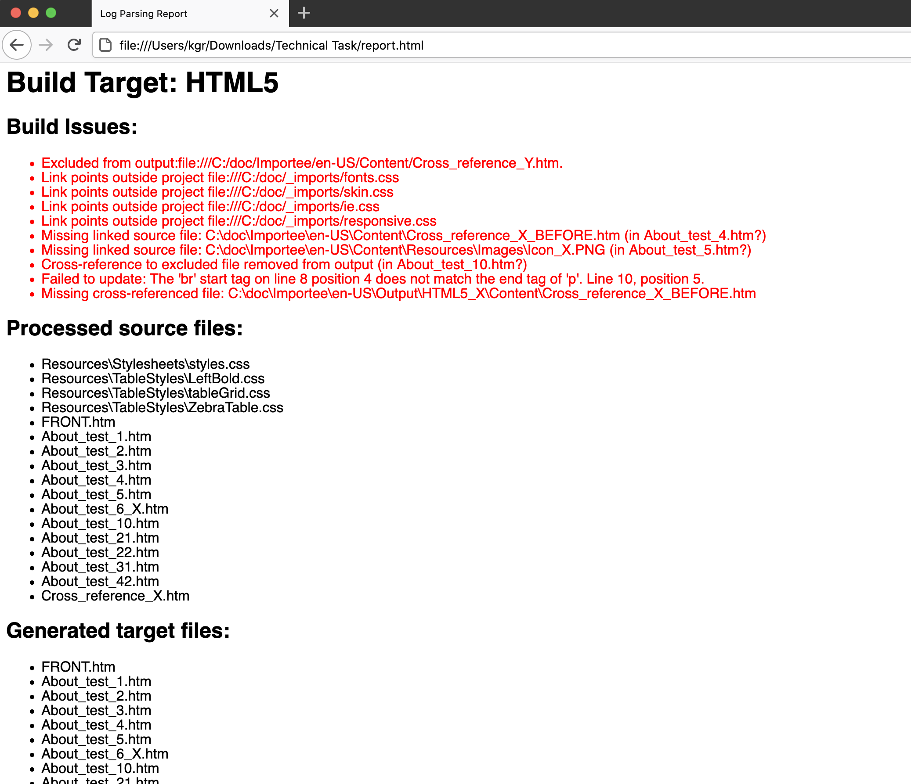
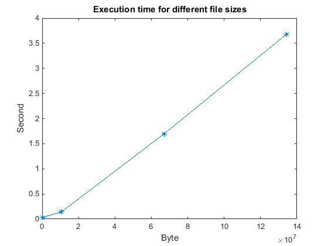

# Log Parser

Technical documentation authoring tools usually allow creation of multiple output formats from the same source files.
Build logs often need to be inspected to determine whether build output meets expectations.
Unfortunately the logs tend to be very long, so there is a risk that informational messages in the
log obscure real issues that need to be addressed.
This repository contains a sample log after building a very small project that had issues.

This script takes a build log file as input argument, parses it, identifies issues,
and outputs a report of the issues in XML format `report.xml`. For each build target it
also displays a list of all processed files, and all generated files.

## Prerequisites
Perl is needed to run the script: www.perl.org/get.html

Due to Cross-Origin Request Blocked the XML cannot be transformed directly in the browser without
modifications of the browser settings. An XSLT processor such as SAXON is therefore needed to transform the output
XML to HTML for viewing in browser: http://saxon.sourceforge.net/

## To run the script
`perl build_report.pl <logfile>`

For example:
```
perl build_report.pl sample.log
Writing out build report to report.xml
Script is done!
```

## To transform the output report to HTML
`saxon report.xml -xsl:html_report.xsl -o:report.html`

## To view the report
Open `report.html` in the browser. It can look like this:



## Execution time
Execution time for different file sizes:


